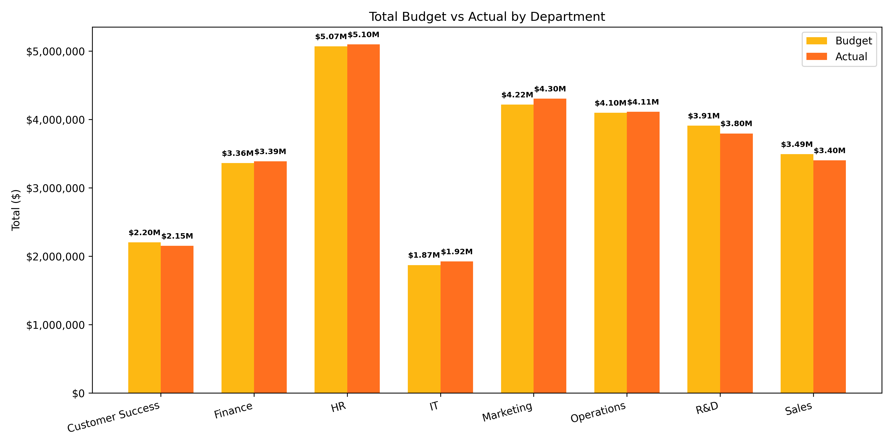
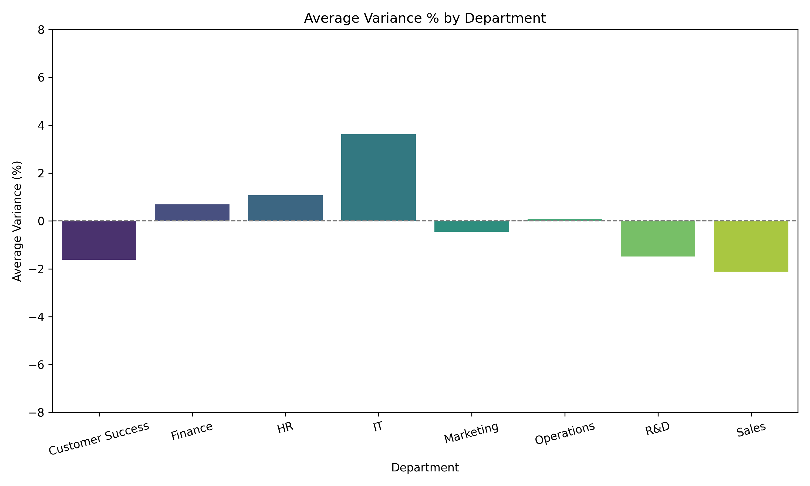
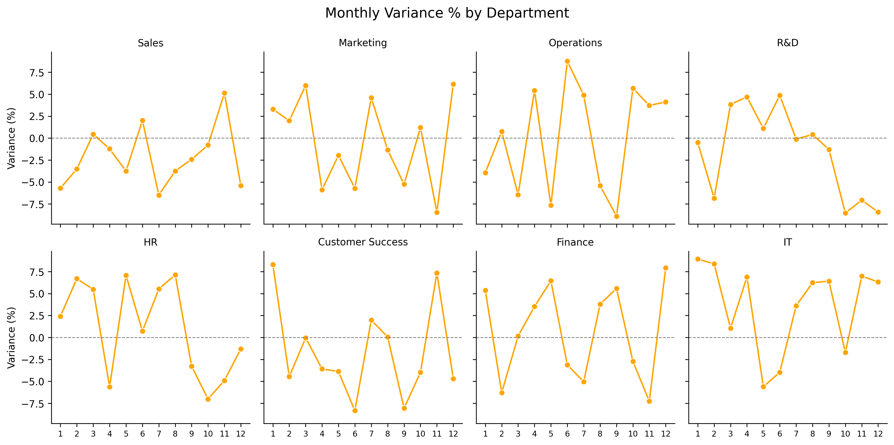
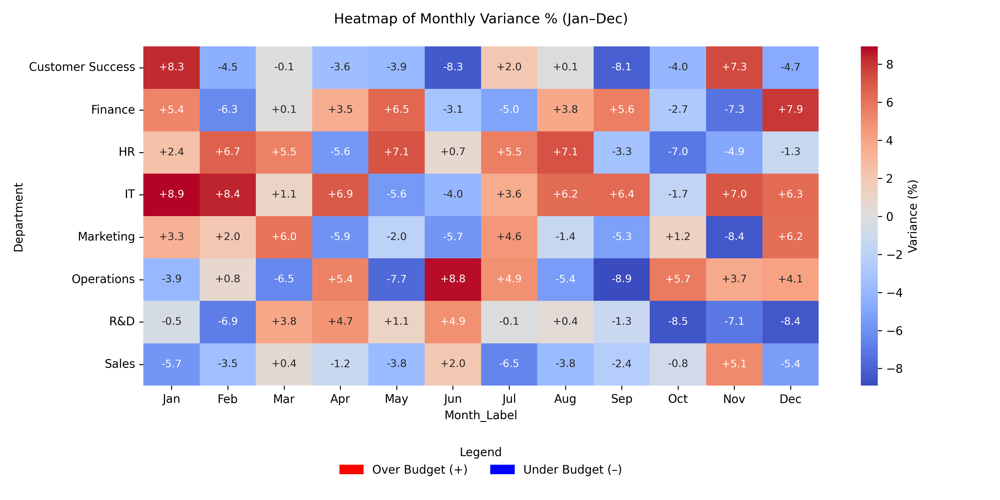
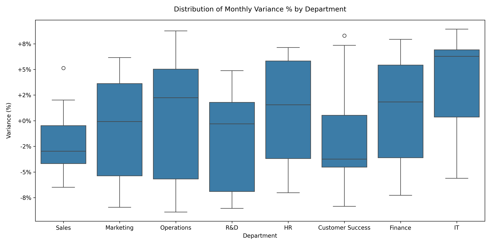

# FP&A Departmental Variance Analysis

Visualizing departmental budget performance using Python and real-world FP&A methods.

---

## Who Is This Project For?

* Finance & FP&A teams analysing budget vs actuals  
* Analysts preparing interview case-studies  
* Business stakeholders needing quick insights  
* Data portfolios that combine visualisation and storytelling  

---

## What’s Inside

| Plot # | File | Description |
|--------|------|-------------|
| **1** | `plot1_total_budget_actual.png` | Total Budget vs Actual by Department (bar) |
| **2** | `plot2_avg_variance_bar_chart.png` | Average Monthly Variance % by Department (bar) |
| **3** | `plot3_faceted_lines.png` | Monthly Variance % by Department (facet grid – 1-12 months) |
| **4** | `plot4_heatmap_variance_pct.png` | Heatmap of Monthly Variance % (Jan–Dec, +/- legend) |
| **5** | `plot5_boxplot_variance_pct.png` | Variance % Distribution by Department (boxplot) |
| **Text** | `executive_summary.txt` | Auto-generated KPI summary (totals + dept level) |

---

## Sample Visuals

| Plot 1 | Plot 2 |
|--------|--------|
|  |  |

| Plot 3 | Plot 4 |
|--------|--------|
|  |  |

| Plot 5 |
|--------|
|  |

---

## Output

This script will generate 5 visualizations and a downloadable executive summary text file in your project folder.

- `plot1_total_budget_actual.png`
- `plot2_avg_variance_bar_chart.png`
- `plot3_faceted_lines.png`
- `plot4_heatmap_variance_pct_signed_legend_moved.png`
- `plot5_boxplot_variance_pct.png`
- `executive_summary.txt`

---

## Tools Used

- Python 3
- pandas
- numpy
- matplotlib
- seaborn

---

_Data is synthetic and designed for demonstration purposes only._

## How to Run

### 1 - Clone the repo
```bash
git clone https://github.com/ameer-nassar/fpa-variance-analysis.git
cd fpa-variance-analysis
```

### 2 - Install requirements
```bash
pip install -r minimum_requirements.txt
```

### 3 - Run the script
```bash
python variance_analysis.py
```
